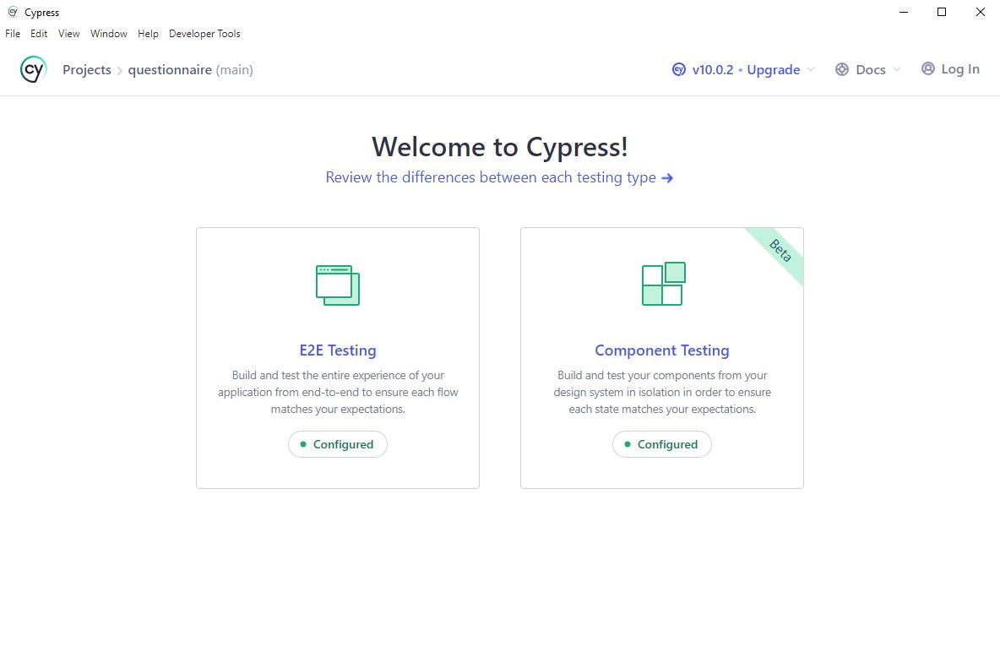

<h1>Questionnaire</h1>

<P style="font-size: 16px">Questionnaire about covid</P>

- [Production Url](https://questionnaire.ibotchori.space)

#

### Table of Contents

- [Prerequisites](#prerequisites)
- [Tech Stack](#tech-stack)
- [Getting Started](#getting-started)
- [Project Structure](#project-structure)
- [Deployment](#deployment)

#

### Prerequisites

- _Node JS @16.X and up_
- _npm @6 and up_

#

### Tech Stack

- [React @18.00.0](https://reactjs.org) - front-end framework
- [React Router Dom @6](https://reactrouter.com) - fully-featured routing library
- [Redux Toolkit](https://redux-toolkit.js.org/) - A Predictable State Container for JS Apps
- [Tailwlind Css @3](https://tailwindui.com/documentation) - A utility-first CSS framework
- [React Hook Form @7 ](https://react-hook-form.com) - easy form validation
- [Cypress](https://docs.cypress.io) - testing tool built for the modern web.

#

## Getting Started

#

### Clone repository

#

1\. First of all you need to clone Covid repository from github:

```sh
git clone https://github.com/ibotchori/questionnaire.git
```

2\. Next step requires install all the dependencies.

```sh
npm install
```

#


3\. After installing all dependencies and env setup you can start project

```
 npm start

```

#

### Opening Cypress

Before you open cypress copy configs from cypress.config.ts.example to your newly created cypress.config.ts file with command:

```sh
cp cypress.config.ts.example cypress.config.ts
```

---

```sh
npx cypress open
```

After a moment, the Cypress Test Runner will launch.

---



---

For running all test at once type:

```sh
npx cypress run --headed
```

After you can run example tests.add your own tests to:

```sh
/yourProject/cypress/e2e/questionnaire
```

#

### Project Structure

```bash
├─── coverage   # cypress folder
├─── cypress   # cypress configuration folder
├─── src      # project source codes
    ├─── app       # redux-toolkit state management
    ├─── assets       # project images and fonts
    ├─── components   # reusable components
        -index.js  # export default 
    ├─── features   # redux-toolkit slices
    ├─── helpers   
        ├─── Schema      # form validations
    ├─── layout   # page layout (wrapper)
    ├─── pages   # react navigation screens
    - App.jsx   # application main file
- babelrc   # babel config file
- .gitignore 
- cypress.config.ts   # cypress config file
- jsconfig.json   # javascript config file
- package-lock.json     # dependency manager configurations
- package.json     # dependency manager configurations
- tailwind.config.js    # tailwindcss config file

```

### Deployment

```sh
npm run build
```

- creates a build directory with a production build of your app. Set up your favorite HTTP server so that a visitor to your site is served index.html, and requests to static paths like /static/js/main.<hash>.js are served with the contents of the /static/js/main.<hash>.js file. For more information see the [production](https://create-react-app.dev/docs/production-build/) build section.
